# Manual Técnico
## Sistema Integral de Monitoreo, Análisis y Respuesta de Seguridad a Nivel Kernel
**Sistemas Operativos 2 — USAC FIUSAC**
**Kernel Linux 6.12.69 LTS**

---

## Tabla de Contenidos

1. [Arquitectura del Sistema](#1-arquitectura-del-sistema)
2. [Entorno de Desarrollo](#2-entorno-de-desarrollo)
3. [Modificaciones al Kernel](#3-modificaciones-al-kernel)
   - 3.1 [Estructura de archivos modificados](#31-estructura-de-archivos-modificados)
   - 3.2 [Registro de syscalls](#32-registro-de-syscalls)
   - 3.3 [sys_get_process_info (548)](#33-sys_get_process_info-548)
   - 3.4 [sys_get_system_monitor (549)](#34-sys_get_system_monitor-549)
   - 3.5 [sys_file_analize (550)](#35-sys_file_analize-550)
   - 3.6 [sys_scan_processes (551)](#36-sys_scan_processes-551)
   - 3.7 [sys_quarantine_file (552)](#37-sys_quarantine_file-552)
   - 3.8 [sys_restore_file (553)](#38-sys_restore_file-553)
   - 3.9 [sys_get_quarantine_list (554)](#39-sys_get_quarantine_list-554)
   - 3.10 [sys_simulate_panic (555)](#310-sys_simulate_panic-555)
   - 3.11 [Compilación del Kernel](#311-compilación-del-kernel)
4. [Programa Intermedio (Daemon)](#4-programa-intermedio-daemon)
   - 4.1 [Arquitectura del daemon](#41-arquitectura-del-daemon)
   - 4.2 [Thread 1 — Monitoreo](#42-thread-1--monitoreo)
   - 4.3 [Thread 2 — Escaneo de archivos](#43-thread-2--escaneo-de-archivos)
   - 4.4 [Sistema de alertas](#44-sistema-de-alertas)
   - 4.5 [Hash Blacklist](#45-hash-blacklist)
   - 4.6 [Autenticación PAM](#46-autenticación-pam)
   - 4.7 [Control de roles y permisos](#47-control-de-roles-y-permisos)
   - 4.8 [Servidor HTTP](#48-servidor-http)
   - 4.9 [Manejo de errores](#49-manejo-de-errores)
5. [Dashboard Web (Frontend)](#5-dashboard-web-frontend)
6. [Flujo de Datos](#6-flujo-de-datos)
7. [Pruebas Realizadas](#7-pruebas-realizadas)
8. [Decisiones de Diseño](#8-decisiones-de-diseño)

---

## 1. Arquitectura del Sistema

El sistema se compone de tres capas principales que se comunican entre sí de forma secuencial:

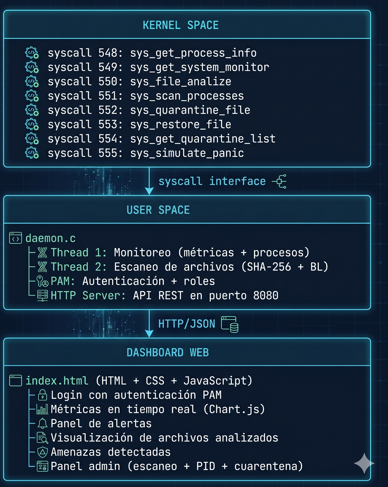


---

## 2. Entorno de Desarrollo

| Componente | Detalle |
|---|---|
| Sistema Operativo | Lubuntu 24.04 (VM VirtualBox) |
| Kernel | Linux 6.12.69 LTS |
| Compilador | GCC 12.x |
| Herramientas | make, bc, libssl-dev, libelf-dev |
| Librerías daemon | libmicrohttpd, libpam, libcjson, pthread |
| Dashboard | HTML5 + CSS3 + JavaScript + Chart.js 4.4.1 |
| Virtualización | VirtualBox 7.x con NAT + 50GB disco |

### Dependencias instaladas

```bash
sudo apt install -y build-essential gcc make bc \
    libncurses-dev libssl-dev libelf-dev bison flex \
    dwarves zstd libmicrohttpd-dev libpam0g-dev libcjson-dev
```

### Configuración de compilación del kernel

Para reducir el tiempo de compilación en la VM se usaron las siguientes optimizaciones:

```bash
# Usar solo módulos actualmente cargados
make localmodconfig

# Deshabilitar BTF (evita error de vmlinux con libbpf)
scripts/config --disable DEBUG_INFO_BTF
scripts/config --disable DEBUG_INFO
scripts/config --set-val DEBUG_INFO_NONE y

# Deshabilitar firmas de módulos (no necesarias en VM de desarrollo)
scripts/config --disable SYSTEM_TRUSTED_KEYS
scripts/config --disable SYSTEM_REVOCATION_KEYS
scripts/config --disable MODULE_SIG
scripts/config --disable MODULE_SIG_ALL
```

> **Decisión:** Se usó `localmodconfig` en lugar de `olddefconfig` porque reduce el número de módulos compilados de ~5000 a ~200, reduciendo el tiempo de compilación de 60+ minutos a ~20 minutos en la VM.

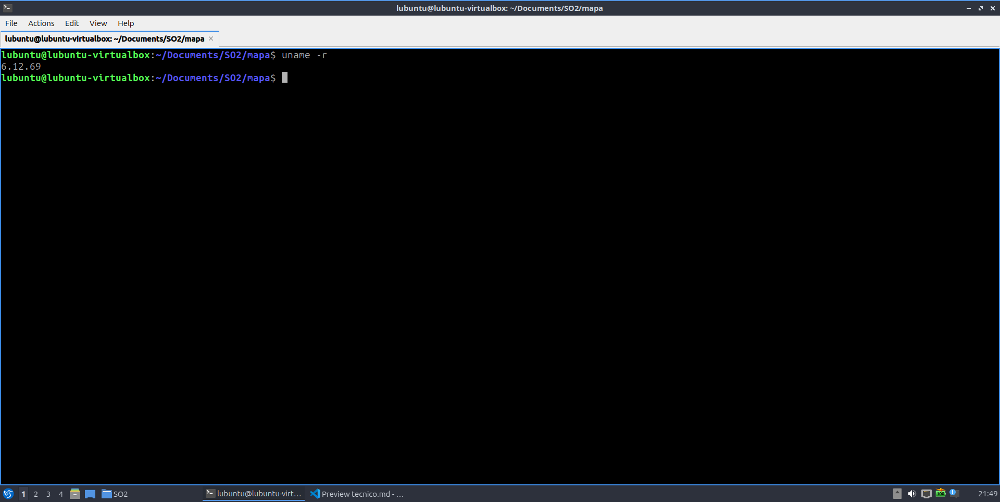

---

## 3. Modificaciones al Kernel

### 3.1 Estructura de archivos modificados

Solo se modificaron o crearon los siguientes archivos dentro del árbol del kernel. El resto del kernel fuente no fue alterado:

```
linux-6.12.69/
├── arch/x86/entry/syscalls/
│   └── syscall_64.tbl              ← MODIFICADO: +8 entradas
├── include/linux/
│   └── syscalls.h                  ← MODIFICADO: +8 prototipos
├── kernel/
│   ├── Makefile                    ← MODIFICADO: +8 subdirectorios
│   ├── get_process_info/           ← NUEVO
│   │   ├── Makefile
│   │   └── get_process_info.c
│   ├── get_system_monitor/         ← NUEVO
│   │   ├── Makefile
│   │   └── get_system_monitor.c
│   ├── file_analize/               ← NUEVO
│   │   ├── Makefile
│   │   └── file_analize.c
│   ├── scan_processes/             ← NUEVO
│   │   ├── Makefile
│   │   └── scan_processes.c
│   ├── quarantine/                 ← NUEVO
│   │   ├── Makefile
│   │   └── quarantine.c
│   └── simulate_panic/             ← NUEVO
│       ├── Makefile
│       └── simulate_panic.c
```

Cada subdirectorio de syscall contiene su propio `Makefile` con `obj-y := <archivo>.o`, lo cual le indica al sistema de build del kernel que compile ese objeto y lo enlace estáticamente al kernel.

### 3.2 Registro de syscalls

Las syscalls se registran en `arch/x86/entry/syscalls/syscall_64.tbl`. Este archivo mapea números de syscall a sus implementaciones:

```
548  common  get_process_info      sys_get_process_info
549  common  get_system_monitor    sys_get_system_monitor
550  common  file_analize          sys_file_analize
551  common  scan_processes        sys_scan_processes
552  common  quarantine_file       sys_quarantine_file
553  common  restore_file          sys_restore_file
554  common  get_quarantine_list   sys_get_quarantine_list
555  common  simulate_panic        sys_simulate_panic
```

> **Decisión:** Se eligieron los números 548-555 porque son los primeros disponibles después de las syscalls estándar de Linux 6.12 (que llegan hasta ~547). El campo `common` indica que la syscall es accesible tanto desde procesos de 32 como de 64 bits.

Los prototipos se agregaron en `include/linux/syscalls.h` justo antes del `#endif` final:

```c
asmlinkage long sys_get_process_info(int pid, struct process_info __user *info);
asmlinkage long sys_get_system_monitor(struct system_monitor_info __user *info);
asmlinkage long sys_file_analize(const char __user *path, struct file_info __user *info);
asmlinkage long sys_scan_processes(struct process_scan_entry __user *buf, int max_count);
asmlinkage long sys_quarantine_file(const char __user *path);
asmlinkage long sys_restore_file(const char __user *path);
asmlinkage long sys_get_quarantine_list(struct quarantine_entry __user *buf, int max_count);
asmlinkage long sys_simulate_panic(const char __user *msg);
```

> **Nota:** El compilador emite warnings indicando que los structs están declarados dentro de la lista de parámetros. Esto ocurre porque los structs están definidos en los archivos `.c` individuales y no son visibles desde `syscalls.h`. Los warnings no afectan la compilación ni el funcionamiento.

### 3.3 sys_get_process_info (548)

**Propósito:** Obtener información detallada de un proceso específico dado su PID.

**Struct de retorno:**
```c
struct process_info {
    int  pid;
    char name[16];    // TASK_COMM_LEN = 16
    long cpu_time;    // utime + stime en nanosegundos
    long mem_kb;      // RSS en kilobytes
};
```

**Implementación clave:**
- Se usa `find_task_by_vpid(pid)` dentro de un bloque `rcu_read_lock()` para acceder al `task_struct` del proceso de forma segura.
- La memoria RSS se obtiene con `get_task_mm()` + `get_mm_rss()` × `PAGE_SIZE`.
- `copy_to_user()` transfiere la estructura al espacio de usuario.

**Decisión de diseño:** Esta syscall fue implementada en la Práctica 5 y reutilizada sin modificaciones en el proyecto, conforme al enunciado.


### 3.4 sys_get_system_monitor (549)

**Propósito:** Obtener métricas globales de memoria y el top 10 de procesos por consumo de RAM.

**Struct de retorno:**
```c
struct system_monitor_info {
    unsigned long long memoria_total;
    unsigned long long memoria_usada;
    unsigned long long memoria_libre;
    unsigned long long memoria_cache;
    unsigned long long swap_total;
    unsigned long long swap_usada;
    unsigned long long fallos_menores;
    unsigned long long fallos_mayores;
    unsigned long long paginas_activas;
    unsigned long long paginas_inactivas;
    struct top_proc top_processes[10];
    int top_count;
};
```

**Funciones del kernel utilizadas:**

| Función | Dato obtenido |
|---|---|
| `si_meminfo(&si)` | totalram, freeram, totalswap, freeswap |
| `global_node_page_state(NR_FILE_PAGES)` | memoria_cache |
| `global_node_page_state(NR_ACTIVE_ANON/FILE)` | paginas_activas |
| `global_node_page_state(NR_INACTIVE_ANON/FILE)` | paginas_inactivas |
| `global_node_page_state(PGMAJFAULT)` | fallos_mayores |
| `global_node_page_state(PGFAULT)` | fallos totales |
| `for_each_process()` | iteración de procesos |

**Top 10 procesos:** Se implementó con un insertion sort in-place sobre un arreglo de 10 entradas. Por cada proceso se llama a `get_task_mm()` para obtener su RSS. Los procesos sin `mm_struct` (procesos del kernel) se omiten.

**Decisión:** `memoria_usada = total - libre - cache`, que es la misma fórmula que usa el comando `free` de Linux. Esto da el valor de memoria realmente usada por aplicaciones, excluyendo el cache del sistema operativo.


### 3.5 sys_file_analize (550)

**Propósito:** Obtener tamaño, timestamp de última modificación y hash SHA-256 de un archivo.

**Struct de retorno:**
```c
struct file_info {
    long long size;
    long long last_modified;  // segundos epoch
    char sha256[65];          // 64 hex chars + null terminator
};
```

**Cálculo SHA-256 en kernel space:**

El kernel provee una API criptográfica (`crypto/hash.h`) que permite calcular hashes sin depender de bibliotecas de usuario:

```c
struct crypto_shash *tfm = crypto_alloc_shash("sha256", 0, 0);
struct shash_desc *desc = kmalloc(sizeof(*desc) + crypto_shash_descsize(tfm), GFP_KERNEL);
// leer archivo en bloques de 4096 bytes con kernel_read()
// actualizar hash con crypto_shash_update()
// finalizar con crypto_shash_final()
```

**Acceso al archivo:**
- `kern_path()` resuelve la ruta del archivo dentro del VFS
- `vfs_getattr()` obtiene tamaño y timestamps
- `filp_open()` + `kernel_read()` lee el contenido para calcular el hash

**Decisión:** Calcular el SHA-256 directamente en el kernel garantiza que el hash refleja exactamente el contenido del archivo en el momento de la syscall, sin que una aplicación de usuario pueda interferir. Esto es importante para la detección de malware.


### 3.6 sys_scan_processes (551)

**Propósito:** Devolver un arreglo con información de todos los procesos activos para análisis en espacio de usuario.

**Struct por proceso:**
```c
struct process_scan_entry {
    int  pid;
    char name[16];
    unsigned long mem_kb;
    unsigned long long cpu_time;
};
```

**Implementación:** Itera todos los procesos con `for_each_process()` dentro de `rcu_read_lock()`. Usa `kmalloc_array()` para alocar el buffer en kernel space antes de copiarlo con `copy_to_user()`.

**Restricción del enunciado cumplida:** Esta syscall NO clasifica severidad ni detecta comportamiento anómalo. Solo devuelve datos crudos. La decisión de si un proceso es sospechoso se toma exclusivamente en el daemon (user space).


### 3.7 sys_quarantine_file (552)

**Propósito:** Registrar un archivo como "en cuarentena" dentro de una lista interna del kernel.

**Lista interna:**
```c
static struct quarantine_entry q_list[MAX_QUARANTINE]; // máx 64 entradas
static int q_count = 0;
static DEFINE_SPINLOCK(q_lock);
```

**Comportamiento:**
1. Verifica que el archivo exista con `kern_path()`
2. Verifica que no haya duplicados
3. Agrega la ruta y timestamp a la lista
4. **No mueve ni elimina el archivo físicamente**

**Decisión:** Se usa un spinlock (`DEFINE_SPINLOCK`) en lugar de un mutex porque las operaciones sobre la lista son muy cortas y no duermen. Los spinlocks son más eficientes para secciones críticas breves en kernel space.

### 3.8 sys_restore_file (553)

**Propósito:** Eliminar un archivo de la lista de cuarentena.

Busca la ruta en `q_list`, y si la encuentra, desplaza los elementos posteriores para eliminarla. Retorna `-ENOENT` si el archivo no está en cuarentena.

**Nota:** Esta operación tampoco modifica el archivo en disco. Solo actualiza la lista interna del kernel.

### 3.9 sys_get_quarantine_list (554)

**Propósito:** Exponer la lista completa de archivos en cuarentena al espacio de usuario.

Copia el arreglo `q_list` completo al buffer de usuario con `copy_to_user()`. Retorna el número de entradas copiadas.

### 3.10 sys_simulate_panic (555)

**Propósito:** Simular un evento crítico del kernel escribiendo un mensaje de emergencia en el log del sistema, sin causar un kernel panic real.

```c
printk(KERN_EMERG "[SECURITY] Simulated kernel panic: %s\n", msg);
```

**Restricción del enunciado cumplida:** No se llama a `panic()` real. El sistema operativo continúa funcionando normalmente después de la llamada.

**Casos de activación (invocados desde el daemon):**
- Detección de hash malicioso con severidad HIGH
- Alto consumo de memoria persistente por múltiples ciclos
- Proceso consumiendo >50% de memoria

El mensaje es visible con `sudo dmesg | grep SECURITY`.


### 3.11 Compilación del Kernel

```bash
cd /home/lubuntu/Documents/SO2/linux-6.12.69

# Configurar swap adicional (evita OOM killer durante el linking)
sudo fallocate -l 4G /home/lubuntu/swap2
sudo chmod 600 /home/lubuntu/swap2
sudo mkswap /home/lubuntu/swap2
sudo swapon /home/lubuntu/swap2

# Compilar con 2 hilos (conserva RAM en VM)
make -j2 2>&1 | tee compilacion.log

# Instalar
sudo make modules_install
sudo make install
sudo reboot
```

> **Decisión:** Se usan solo 2 hilos en `make -j2` para evitar que el proceso de linking final consuma demasiada RAM y sea terminado por el OOM killer (Error 137). Esto alarga la compilación pero la hace confiable.


---

## 4. Programa Intermedio (Daemon)

### 4.1 Arquitectura del daemon

El daemon es un programa en C que se ejecuta en segundo plano como root. Su arquitectura es:

```
main()
├── Cargar hash_blacklist.json
├── Crear directorio monitor_dir/
├── pthread_create → thread_monitor (Thread 1)
├── pthread_create → thread_scanner (Thread 2)
└── MHD_start_daemon → HTTP server (Thread interno de libmicrohttpd)

Thread 1 (monitor):
└── Loop: syscall(SYS_GET_SYSTEM_MONITOR)
         syscall(SYS_SCAN_PROCESSES)
         → evaluar umbrales
         → add_alert() si corresponde
         → sleep(5)

Thread 2 (scanner):
└── Loop: opendir(monitor_dir)
         → para cada archivo: syscall(SYS_FILE_ANALIZE)
         → comparar hash con blacklist
         → comparar con registro previo
         → add_alert() si corresponde
         → sleep(10)

HTTP server:
└── http_handler() → procesa cada petición HTTP
    ├── POST /login    → authenticate() con PAM
    ├── GET  /metrics  → build_metrics_json()
    ├── GET  /alerts   → build_alerts_json()
    ├── GET  /files    → build_files_json()
    ├── GET  /threats  → build_threats_json()
    ├── GET  /quarantine
    ├── GET  /process/:pid
    ├── POST /scan/start
    └── POST /scan/stop
```

**Concurrencia:** Los datos compartidos entre threads están protegidos con `pthread_mutex_t`:

| Mutex | Protege |
|---|---|
| `sysinfo_mutex` | `g_sysinfo` (métricas del sistema) |
| `alerts_mutex` | arreglo `alerts[]` |
| `files_mutex` | arreglo `file_records[]` |
| `scan_mutex` | variable `scan_active` |
| `sessions_mutex` | arreglo `sessions[]` |

### 4.2 Thread 1 — Monitoreo

Se ejecuta cada 5 segundos (`MONITOR_INTERVAL = 5`). Realiza:

1. Invoca `sys_get_system_monitor()` para obtener métricas globales
2. Actualiza `g_sysinfo` bajo `sysinfo_mutex`
3. Evalúa umbrales de alerta:
   - Si `memoria_usada / memoria_total > 80%` → alerta MEDIUM
   - Si la condición anterior se mantiene 3 ciclos → alerta HIGH + `sys_simulate_panic()`
   - Si `fallos_mayores - prev_mayor > 100` → alerta MEDIUM
4. Invoca `sys_scan_processes()` y revisa si algún proceso usa >50% de RAM → alerta HIGH

**Decisión:** La severidad se calcula exclusivamente en el daemon, nunca en el kernel. Esto cumple con el enunciado y sigue el principio de separación de responsabilidades.

### 4.3 Thread 2 — Escaneo de archivos

Se ejecuta cada 10 segundos (`SCAN_INTERVAL = 10`). Puede ser pausado por el admin desde el dashboard.

Para cada archivo en `monitor_dir/`:
1. Invoca `sys_file_analize()` → obtiene SHA-256, tamaño y timestamp
2. Busca el archivo en `file_records[]`:
   - Si no existe → archivo nuevo → alerta LOW
   - Si existe y el hash cambió → archivo modificado → alerta MEDIUM
3. Compara el hash contra la blacklist:
   - Si coincide → alerta con la severidad de la firma
   - Invoca `sys_quarantine_file()` automáticamente
   - Si la severidad es HIGH → invoca `sys_simulate_panic()`

### 4.4 Sistema de alertas

```c
typedef struct {
    char       type[32];         // "memoria", "proceso", "archivo", "sistema"
    char       description[256];
    severity_t severity;         // SEV_LOW, SEV_MEDIUM, SEV_HIGH
    time_t     timestamp;
} alert_t;

static alert_t alerts[MAX_ALERTS]; // MAX_ALERTS = 256
```

La función `add_alert()` es thread-safe gracias a `alerts_mutex`. Cuando el arreglo está lleno, desplaza las alertas más antiguas para hacer espacio a las nuevas (buffer circular).

Toda alerta con severidad HIGH automáticamente invoca `sys_simulate_panic()` con la descripción como mensaje.

### 4.5 Hash Blacklist

El archivo `hash_blacklist.json` define 8 firmas de amenazas simuladas:

```json
{
  "signatures": [
    {
      "hash": "<SHA-256>",
      "name": "Simulated.Ransomware.Encryptor",
      "severity": "HIGH",
      "description": "Ransomware encriptador simulado"
    },
    ...
  ]
}
```

**Distribución de severidades:**
- LOW: 2 firmas
- MEDIUM: 3 firmas
- HIGH: 3 firmas (incluye Ransomware, Backdoor y Rootkit)

La blacklist se carga al iniciar el daemon con `load_blacklist()` usando la librería cJSON para parsear el JSON.

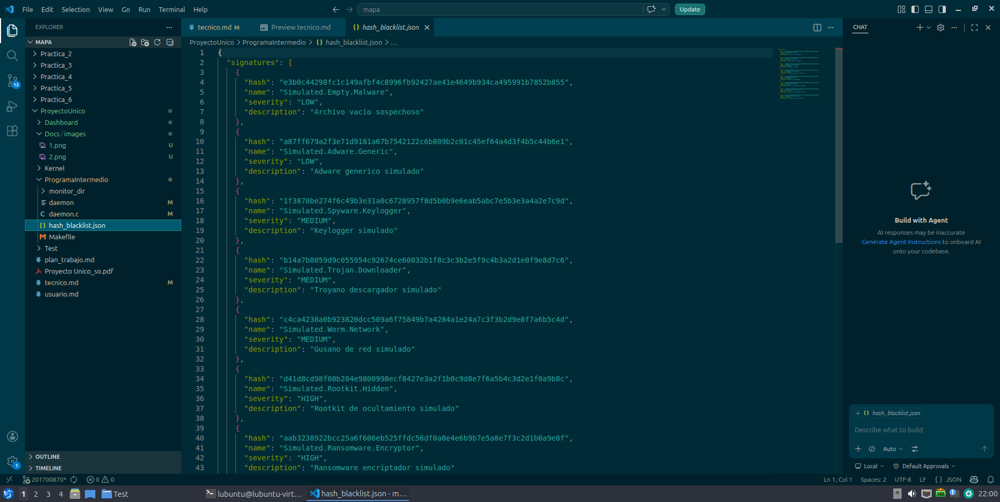

### 4.6 Autenticación PAM

PAM (Pluggable Authentication Modules) permite autenticar usuarios del sistema operativo sin manejar contraseñas directamente. El daemon implementa:

```c
// Conversación PAM: provee la contraseña cuando PAM la pide
static int pam_conv_fn(int num_msg, const struct pam_message **msg,
                       struct pam_response **resp, void *data) { ... }

// Autenticación principal
static int authenticate(const char *username, const char *password) {
    pam_start("login", username, &conv, &pamh);
    pam_authenticate(pamh, 0);  // verifica credenciales
    // verificar grupo
    if (check_group(username, "admin_user"))  return 2; // admin
    if (check_group(username, "common_user")) return 1; // usuario
    return 0; // denegado
}
```

**Grupos del sistema:**

```bash
sudo groupadd admin_user
sudo groupadd common_user
sudo usermod -aG admin_user lubuntu
sudo usermod -aG common_user usuario_prueba
```

Si un usuario pertenece a ambos grupos, se le asigna rol de administrador (conforme al enunciado).

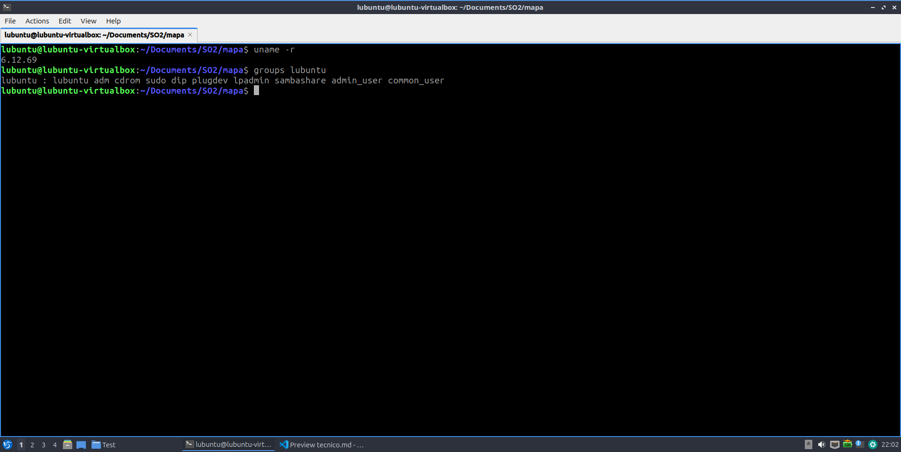

### 4.7 Control de roles y permisos

La validación de permisos se realiza **exclusivamente en el daemon**, nunca en el frontend. Cada endpoint protegido verifica el token de sesión y el rol:

| Endpoint | Rol mínimo requerido |
|---|---|
| `POST /login` | Ninguno |
| `GET /metrics` | user o admin |
| `GET /alerts` | user o admin |
| `GET /files` | user o admin |
| `GET /threats` | user o admin |
| `GET /quarantine` | admin |
| `GET /process/:pid` | admin |
| `POST /scan/start` | admin |
| `POST /scan/stop` | admin |

Los tokens de sesión son strings aleatorios de 32 caracteres generados con `gen_token()`. Se almacenan en memoria en el arreglo `sessions[]` (máximo 16 sesiones simultáneas).

### 4.8 Servidor HTTP

Se usa la librería `libmicrohttpd` para el servidor HTTP embebido. El servidor escucha en `0.0.0.0:8080` y atiende peticiones en un thread interno propio.

Para manejar cuerpos POST el handler implementa acumulación de datos:

```c
if (*con_cls == NULL) {
    // Primera llamada: inicializar buffer
    struct req_body *rb = calloc(1, sizeof(*rb));
    *con_cls = rb;
    return MHD_YES;
}
// Llamadas siguientes: acumular datos
if (*upload_size > 0) {
    rb->data = realloc(rb->data, rb->size + *upload_size + 1);
    memcpy(rb->data + rb->size, upload, *upload_size);
    ...
}
```

Todos los endpoints incluyen headers CORS:
```
Access-Control-Allow-Origin: *
Access-Control-Allow-Headers: Authorization, Content-Type
Access-Control-Allow-Methods: GET, POST, OPTIONS
```

### 4.9 Manejo de errores

El daemon maneja los siguientes casos de error sin terminar abruptamente:

| Error | Manejo |
|---|---|
| Syscall falla | Se registra en stderr y se continúa el ciclo |
| `monitor_dir` no existe | Se crea automáticamente con `mkdir()` |
| `hash_blacklist.json` no encontrado | Warning en stderr, daemon continúa sin blacklist |
| Puerto 8080 ocupado | Error fatal con mensaje descriptivo |
| Buffer de alertas lleno | Se desplazan las alertas más antiguas |
| Token inválido | HTTP 401 con mensaje JSON |
| Permiso insuficiente | HTTP 403 con mensaje JSON |

---

## 5. Dashboard Web (Frontend)

El dashboard es un archivo HTML único (`index.html`) que usa:
- **Chart.js 4.4.1** (CDN) para las gráficas
- **CSS Variables** para el tema visual consistente
- **Fetch API** para comunicación con el daemon
- **Google Fonts** (Orbitron + Share Tech Mono) para tipografía

### Pantalla de login

Verifica credenciales contra `POST /login`. Si el login falla, muestra el error del daemon. Si tiene éxito, almacena el token en memoria (variable JavaScript) y determina si mostrar el tab Admin.

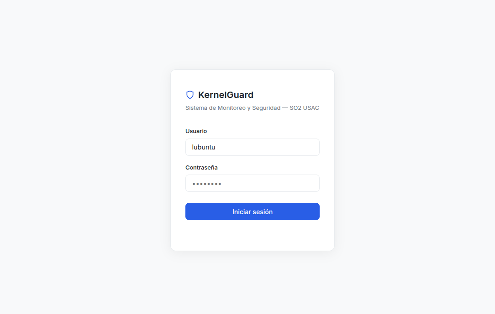

### Sección Métricas

Incluye las 5 visualizaciones requeridas por el enunciado:

| Gráfica | Tipo | Datos |
|---|---|---|
| Desglose de Memoria | Doughnut | Usada / Libre / Cache |
| Estado de Páginas | Doughnut | Activas / Inactivas |
| RAM vs Swap en tiempo real | Line | Historia de los últimos 20 puntos |
| Tasa de Fallos de Página | Bar | Deltas de minor/major faults |
| Top 10 Procesos | Tabla | PID, nombre, KB, % con barra visual |


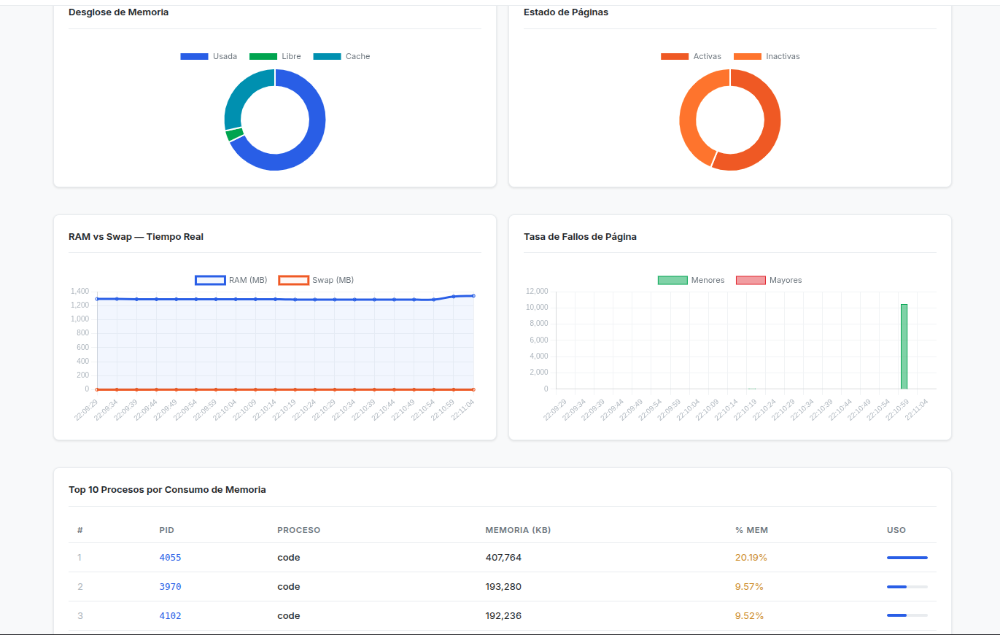

### Sección Alertas

Muestra alertas en orden descendente (más recientes primero). Cada alerta tiene:
- Color de borde según severidad (verde/amarillo/rojo)
- Tipo de evento
- Descripción
- Fecha y hora

> **Screenshot sugerido:** Panel de alertas con alertas de diferentes severidades.

### Sección Amenazas

Muestra tarjetas para cada archivo cuyo hash coincide con la blacklist, con nombre de la firma, descripción, severidad y archivo afectado.

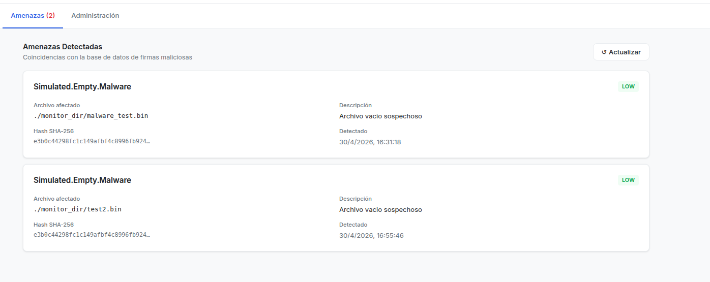


### Panel Admin

Solo visible para usuarios con rol `admin`. Permite:
- Activar/desactivar el escaneo continuo
- Consultar información de un proceso por PID
- Ver y restaurar archivos en cuarentena

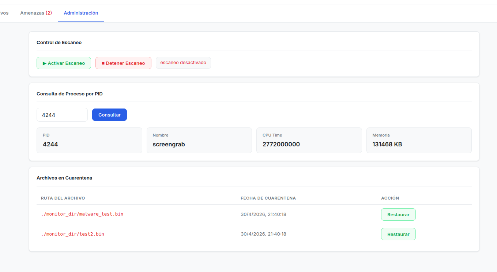

### Funcionalidad Adicional: Contador de Amenazas en Header

Se implementó un contador de amenazas activas visible en el header del dashboard. Cuando hay amenazas detectadas, aparece un badge rojo parpadeante con el número de amenazas:

```javascript
if (d.length > 0) {
    countEl.textContent = d.length;
    counter.style.display = 'block';
}
```

El contador se actualiza automáticamente cada 5 segundos junto con el resto de los datos.

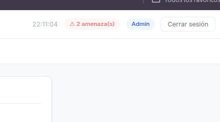

---

## 6. Flujo de Datos

### Login y autenticación

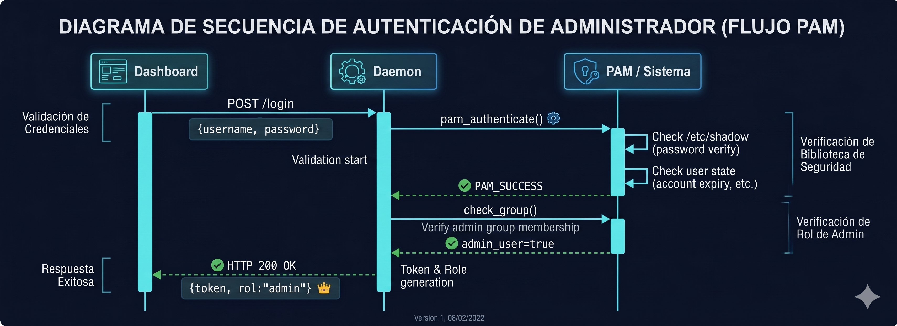

### Ciclo de monitoreo

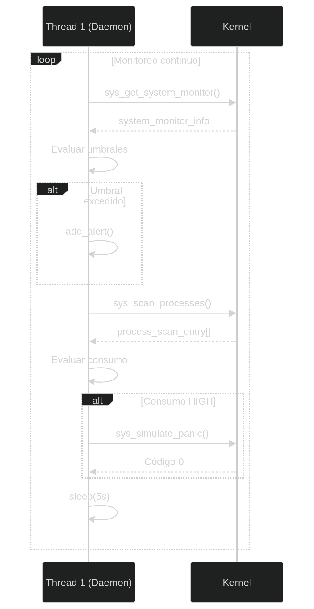

### Detección de malware

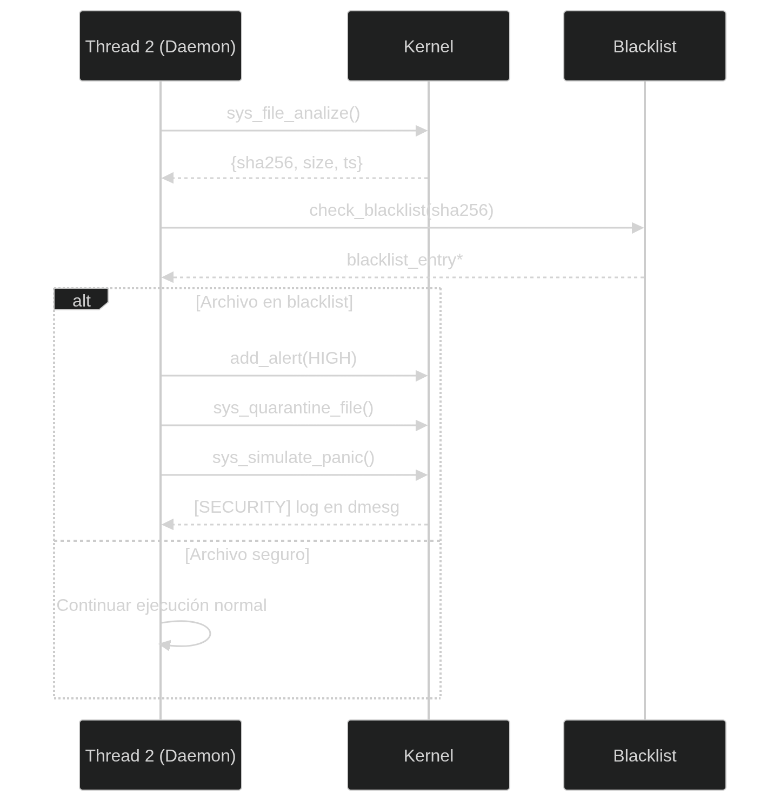

---

## 7. Pruebas Realizadas

### Prueba 1: Syscalls desde userspace

```bash
gcc -o test_syscalls test_syscalls.c
sudo ./test_syscalls
```

Resultado esperado: PID, nombre, CPU time y memoria del proceso de prueba, más métricas del sistema y top 10.

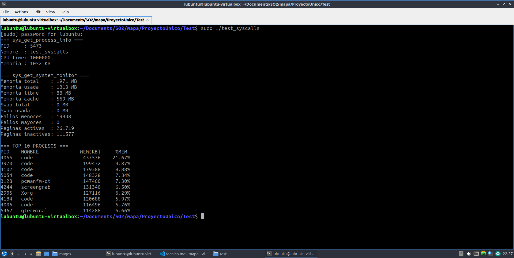

### Prueba 2: Detección de archivo malicioso

```bash
# Archivo vacío = hash e3b0c44... = "Simulated.Empty.Malware" (LOW)
touch monitor_dir/test_malware.bin
# Esperar 10 segundos para el ciclo del scanner
```

Resultado esperado: Alerta en el panel de alertas, archivo aparece como SOSPECHOSO, tarjeta en la sección Amenazas.

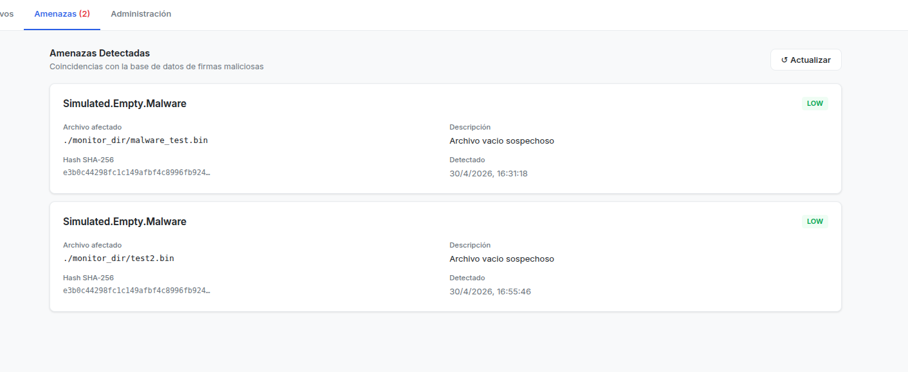

### Prueba 3: Autenticación por roles

```bash
# Login con lubuntu (admin)
# Login con usuario_prueba (common_user)
```

Resultado esperado: `lubuntu` ve el tab Admin, `usuario_prueba` no lo ve.

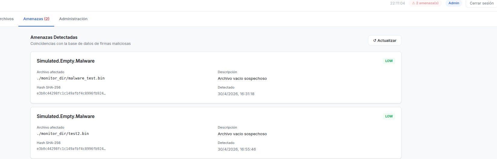

### Prueba 4: sys_simulate_panic

```bash
sudo dmesg | grep SECURITY
```

Resultado esperado:
```
[SECURITY] Simulated kernel panic: <mensaje>
```


### Prueba 5: Cuarentena

Desde el panel Admin, verificar que un archivo sospechoso aparece en la lista de cuarentena y puede ser restaurado.


---

## 8. Decisiones de Diseño

| Decisión | Justificación |
|---|---|
| Severidad calculada en daemon, no en kernel | El enunciado lo requiere explícitamente. Mantiene el kernel liviano y sin lógica de negocio. |
| SHA-256 calculado en kernel space | Garantiza integridad del hash. Un proceso malicioso no puede interceptar el cálculo. |
| Cuarentena simulada (sin mover archivos) | El enunciado lo especifica. Evita efectos secundarios en el sistema de archivos de la VM. |
| `libmicrohttpd` como servidor HTTP | Librería C nativa, sin dependencias de Python/Node. Consistente con el requisito de daemon en C. |
| `localmodconfig` para compilar | Reduce tiempo de compilación de 60+ a ~20 min en VM con recursos limitados. |
| Spinlock para lista de cuarentena | Las operaciones son muy breves. Más eficiente que mutex para secciones críticas cortas. |
| Token como string random de 32 chars | Implementación simple sin JWT. Suficiente para el scope del proyecto académico. |
| Buffer circular para alertas (256 max) | Evita crecimiento ilimitado de memoria. Las alertas más antiguas se descartan automáticamente. |
| `copy_to_user()` en todas las syscalls | Requisito de seguridad del kernel. El acceso directo a punteros de userspace causaría fallos. |
| `kzalloc` / `kmalloc` en kernel | Evitar desbordamiento del stack del kernel (máx ~8KB por función). |


## 9. Arranque con el Kernel Personalizado

### Problema común: el sistema arranca con el kernel original

Después de compilar e instalar el kernel 6.12.69, el sistema puede arrancar con el kernel
original de Lubuntu en lugar del kernel personalizado. Esto causa que todas las syscalls
personalizadas fallen con el error `Function not implemented`.

**Síntoma:**
```bash
$ sudo ./test_syscalls
sys_get_process_info fallo: Function not implemented
sys_get_system_monitor fallo: Function not implemented
```

**Diagnóstico:**
```bash
uname -r
# Si muestra algo distinto a 6.12.69, el sistema arrancó con el kernel equivocado
```

---

### Solución: seleccionar el kernel en GRUB

1. Reiniciar la VM:
```bash
sudo reboot
```

2. Durante el arranque, mantener presionado **Shift** o **Esc** para mostrar el menú de GRUB.

3. Seleccionar **Advanced options for Ubuntu/Lubuntu**.

4. Elegir la entrada que diga **Linux 6.12.69**.

5. Verificar al iniciar sesión:
```bash
uname -r
# Debe mostrar: 6.12.69
```

---

### Solución permanente: establecer el kernel 6.12.69 como predeterminado

Para evitar tener que seleccionar el kernel manualmente en cada arranque, se puede
configurar GRUB para que use el kernel 6.12.69 por defecto.

**Paso 1 — Identificar el índice del kernel en GRUB:**
```bash
grep -n "menuentry" /boot/grub/grub.cfg | head -20
```

Busca la línea que contenga `6.12.69` y anota su posición (empieza desde 0).

**Paso 2 — Editar la configuración de GRUB:**
```bash
sudo nano /etc/default/grub
```

Cambia la línea:
```
GRUB_DEFAULT=0
```

Por:
```
GRUB_DEFAULT="Advanced options for Ubuntu>Ubuntu, with Linux 6.12.69"
```

**Paso 3 — Aplicar los cambios:**
```bash
sudo update-grub
sudo reboot
```

**Paso 4 — Verificar:**
```bash
uname -r
# 6.12.69
```

---

### Verificación rápida del sistema

Antes de iniciar el daemon, siempre verificar que el kernel correcto está activo y
que las syscalls responden:

```bash
# 1. Verificar kernel
uname -r

# 2. Activar swap adicional (necesario para estabilidad)
sudo swapon /home/lubuntu/swap2

# 3. Probar syscalls
cd /home/lubuntu/Documents/SO2
sudo ./test_syscalls

# 4. Si todo responde correctamente, iniciar el daemon
cd /home/lubuntu/Documents/SO2/mapa/ProyectoUnico/ProgramaIntermedio
sudo ./daemon
```

---

### Acceso al dashboard desde el host (Bridged Adapter)

Cuando la VM usa red en modo **Bridged Adapter**, obtiene una IP real en la red local.
Para acceder al dashboard desde el host:

1. Verificar la IP de la VM:
```bash
ip addr | grep "inet " | grep -v 127
# Ejemplo: 192.168.0.25
```

2. Asegurarse de que el `index.html` tenga la IP correcta:
```javascript
const BASE = 'http://192.168.0.25:8080';
```

3. Levantar los servicios:
```bash
# Terminal 1: daemon
sudo ./daemon

# Terminal 2: servidor del dashboard
cd /home/lubuntu/Documents/SO2/mapa/ProyectoUnico/Dashboard
python3 -m http.server 9090
```

4. Desde el host abrir en el navegador:
```
http://192.168.0.25:9090
```

> **Nota:** La IP de la VM puede cambiar entre reinicios si el router asigna IPs dinámicas.
> En ese caso repetir el paso 1 y actualizar `const BASE` en el `index.html`.